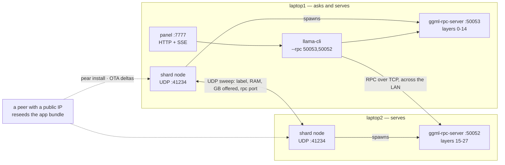

# Shard

**One model. Many machines. No server.**

An LLM whose layers live on different computers. Each machine lends part of its memory and
serves a slice of the network's layers. No machine holds the whole model, and there is no
server anywhere: peers find each other on their own, agree on who serves what, and answer
together.

If a machine leaves, the model is genuinely incomplete — and Shard says so instead of
pretending otherwise.

```
MODEL COMPLETE — 28/28 layers served        MODEL INCOMPLETE — layers 15-27 missing
```

Built at Aleph Hackathon, Buenos Aires, 22-23 August 2026, for the **Tether Pears** track.

Install it from a peer, with no server involved:

```
pear://k6c99su98pmobmw1c4xqtoacsage1is5ayhq9mqdsc8gobdzg8bo
```

---

## Why

ChatGPT is unavailable in 25 countries. In 2025 there were 313 internet shutdowns across
52 countries, the highest number on record.

<sub>Sources: World Population Review (August 2026); Access Now, #KeepItOn.</sub>

A model that lives on a server inherits that server's switch — whoever owns it decides
whether you get to think with it today. Shard has no server to switch off. The model lives
in the machines of the people using it, and it only works when enough of them show up.

---

## What you need first

Shard ships the network, not the engine. `llama.cpp` and the model weigh about 2.9GB
against a 77MB executable — bundling them would make `pear stage` impractical and the OTA
updates impossible, and OTA is the point.

So each machine needs two things once:

**1. llama.cpp built with RPC support.** The RPC backend is not on by default:

```bash
git clone https://github.com/ggml-org/llama.cpp ~/llama.cpp
cd ~/llama.cpp && cmake -B build -DGGML_RPC=ON -DGGML_METAL=ON && cmake --build build --config Release
```

On Linux/Windows drop `-DGGML_METAL=ON` and add your own backend (`-DGGML_CUDA=ON`, etc).

**2. The model.** Any GGUF works; the layer count is what matters:

```bash
mkdir -p ~/models && curl -L -o ~/models/Llama-3.2-3B-Instruct-Q4_K_M.gguf \
  https://huggingface.co/bartowski/Llama-3.2-3B-Instruct-GGUF/resolve/main/Llama-3.2-3B-Instruct-Q4_K_M.gguf
```

Shard looks in the current directory and then in your home directory, so `~/llama.cpp` and
`~/models` are found automatically. `--llama` and `--model` override both.

A machine with no `llama.cpp` still runs — it just offers 0GB and says why, instead of
promising layers it cannot serve. A machine without the model can serve layers for others
but cannot start a question of its own.

## Install and run

```bash
mkdir -p ~/shard
pear install --to ~/shard pear://k6c99su98pmobmw1c4xqtoacsage1is5ayhq9mqdsc8gobdzg8bo
~/shard/hello-pear-bare --label my-laptop --port 50052 --offer 1
```

That one command starts the layer server, the peer discovery and the panel at
`http://localhost:7777`.

`--offer` is how much memory this machine lends, in GB. It is your call, not something we
infer: at ~68MB per layer, 1GB covers 15 of the model's 28 layers, so two machines lending
1GB each are needed to hold it. Half your RAM is the default and covers the whole model on
a modern laptop, which is fine but shows nothing.

Run the same on a second machine on the same network. Within a few seconds both panels show
the same split, and either can ask.

| Flag                                |                                                           |
| ----------------------------------- | --------------------------------------------------------- |
| `--label <name>`                    | name shown to the other peers                             |
| `--port <n>`                        | port where this machine serves its layers (default 50052) |
| `--offer <gb>`                      | memory lent (default: half the machine's RAM)             |
| `--model <path>` / `--llama <path>` | override the search                                       |
| `--web <port>`                      | panel port (default 7777)                                 |
| `--no-panel`                        | run headless                                              |
| `--ask <question>`                  | ask once the model is complete, print, exit               |

On macOS the first run asks for **Local Network** permission. Without it peers never find
each other, and the errors are misleading — see _Things that bit us_ below.

---

## How it fits together



Both machines run the same binary. The only difference between them is that one of them is
the one you asked from: it starts `llama-cli` and points it at every layer server it knows,
its own included. Any node can be that one.

## What each piece does

**Pear / Bare** distributes the app itself. Shard is a standalone CLI built from the
`hello-pear-bare` template: `pear stage` publishes a version, `pear seed` announces it, and
`pear install pear://<key>` installs it directly from another peer. Running instances pick
up new versions over the air and apply them on restart. We published eight versions this way
during the hackathon — the OTA path is how the project was actually developed, not a demo
staged for the video.

**Hyperswarm / Hyperdrive** carry that distribution. Only changed blocks travel: replacing
the whole 80MB binary moved about 6MB over the wire.

**A peer with a public IP** keeps the app reachable. Both of our laptops report
`firewalled true`, and the hole punch between them never closed on any network we tried, so
`pear install` between them failed. A small cloud machine seeds the bundle around the clock
and everyone connects to it directly. It is worth being precise about what it is and is not:
it holds a copy of the app and reseeds it. It does not coordinate anyone, holds no state,
and takes no part in inference. If it disappears, any other machine already seeding keeps
the link alive — that is what seeding means here.

**UDP on the local network** finds peers. Each node listens on 41234 and sweeps its subnet
with a HELLO; whoever receives it replies with its card — label, RPC port, RAM, cores, and
how much memory it lends.

**llama.cpp RPC** moves the tensors. Each machine runs `ggml-rpc-server`; the machine that
asks runs `llama-cli --rpc host:port,host:port` and llama.cpp streams activations between
them over plain TCP.

## How the split is decided

There is no coordinator. Each node sorts the peers it knows by a stable id and walks the
list, giving each one as many layers as its offered memory holds, until the model is
covered. Same set of peers, same result, on every machine — with no message exchanged about
who takes what.

That is the part worth looking at: two machines shown side by side display the same
assignment, and nothing in the middle decided it.

If the offered memory does not cover every layer, the plan is incomplete and names the exact
missing range. Asking then does not start the model at all: no degraded answer, no partial
output. Layers missing, no model.

## The panel

`http://localhost:7777` on each machine — its own panel, not a shared one, because a shared
one would need a server.

The status band is the whole product: amber when every layer is served, red with the missing
range when it is not. Under it, one block per layer, so the gap is something you see rather
than read. Then the machines serving layers, a box to ask, and a log where errors actually
land — including llama.cpp's own complaints, which is how most of the bugs below were found.

---

## What it does not do

- **Discovery does not cross subnets.** Peers must be on the same local network. A
  Hyperswarm-based path for peers over the internet is not built.
- **Two peers both behind symmetric NAT cannot connect** without a relay, which the Pear CLI
  does not expose. This also broke `pear install` between our two laptops, which is why a
  VPS with a public IP seeds the link.
- **The llama.cpp RPC has no authentication or encryption.** The binary warns about this
  itself: anyone on the network can send it work, and the traffic is in the clear.
- **Nothing verifies that a peer computed what it claimed.** There is no proof of execution,
  no redundancy to cross-check against, and no reputation.
- **No redundancy.** Each layer is served by exactly one machine. Lose it and the model is
  incomplete until it returns.
- **A peer dying mid-inference kills that answer.** The model state is evaluated before
  loading, not during.
- **Phones are not shards.** Only machines running a compiled llama.cpp.
- **The model is not distributed by the app.** Every machine fetches its own copy.

## Roadmap

- **Redundancy**: two machines serving the same range, so losing one does not stop the model.
- **Discovery beyond the LAN**, over Hyperswarm with a relay for symmetric NAT.
- **Payments**: per-peer wallets and USDT settlement proportional to layers served. Designed,
  not built — a project may enter only one specific track, and this one is Pears.
- **Distributing the weights over Hyperdrive**, so a new machine gets the model from a peer
  instead of from HuggingFace.
- **Proof that a peer did the work.** The hard, interesting one.

---

## Things that bit us

Kept because they explain why the code looks the way it does.

**`llama-cli` writes its answer to the terminal, not to our pipe.** Its chat interface goes
straight to the controlling terminal, bypassing the subprocess pipe. Our tests redirected
the app's output to a file — no terminal — so it worked here and failed on the other laptop,
where the answer appeared in the terminal while the panel said nothing came back. Both were
true. `--simple-io` fixes it, and its own help says why: _basic IO for better compatibility
in subprocesses_.

**`llama-cli` exits with code 0 when it fails.** Failing to reach an RPC server does not
change the exit code. Treating that as success left the panel silent, so an answer that
never arrived is now an error carrying llama.cpp's last stderr line.

**`ggml-rpc-server` cannot be watched for readiness.** It is C, and with stdout on a pipe
rather than a terminal it block-buffers, so `Starting RPC server` never arrives. The Metal
lines do show up, because those go to stderr, which is unbuffered. Knocking on the port is
both more reliable and closer to what actually matters. It also exits with code 0 when the
port is taken, and a stale server on that port answers the knock — so its own complaint on
the way out is the only reliable signal.

**A peer's card changes while it runs.** A node announces itself before its layer server is
up, offering 0GB, then starts offering memory once it can serve. Emitting `peer` only on
first sight left whoever discovered the other first holding a stale card forever: one screen
read COMPLETE and the other INCOMPLETE, from the same two machines.

**`spawn` throws synchronously in Bare**, where Node reports through an `error` event. A
missing binary took the whole app down with a stack trace instead of saying what was missing.

**`bare-pack` walks the dependency tree statically.** It saw the literal `require('os')` in
the Node fallback branch, tried to resolve it against Bare, and failed the build — even
though that branch never runs there. `lib/runtime.js` hides the Node require behind a
renamed binding.

**macOS lies about local network permission.** Without it you get `No route to host`, which
looks like a routing problem and is not. Terminal.app is exempt, so the same command works
from a terminal and fails from anything else, which masked it for hours.

**`bare-dgram` is unicast only.** No `setBroadcast`, no multicast membership: sends to the
broadcast address report success and never arrive. Hence sweeping the subnet one address at
a time — noisy, but it does not depend on a venue router forwarding multicast.

**A version that crashes on startup cannot update itself.** The updater never gets to run.
The way out is reinstalling by hand.

---

## Development

```bash
npm install
npm test          # 84 tests, no network and no model required
npm run lint
npm start -- --label dev --port 50053 --offer 1
```

Tests run in Bare, so the panel tests make real HTTP requests against a real server, and the
discovery tests drive an injected socket rather than touching the network.

Publishing a new version, from the machine holding the private key:

```bash
npm run make
pear build --package=package.json --darwin-arm64-app out/darwin-arm64/hello-pear-bare --target out/build
pear stage pear://k6c99su98pmobmw1c4xqtoacsage1is5ayhq9mqdsc8gobdzg8bo ./out/build
pear seed pear://k6c99su98pmobmw1c4xqtoacsage1is5ayhq9mqdsc8gobdzg8bo
```

## License

Apache-2.0, inherited from the `hello-pear-bare` template.
